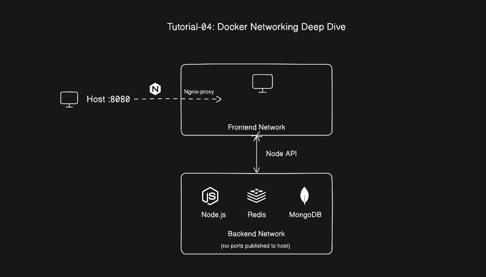

# Tutorial-04: Docker Networking Deep Dive

## Learning Objectives

By the end of this lab, you will understand:

- How Docker networking works at the Linux kernel level — veth pairs, bridges, namespaces
- Why the default bridge network is a trap and how custom bridge networks fix it
- How Docker's embedded DNS resolver works and what NXDOMAIN actually means
- How to segment a multi-tier application into isolated network tiers
- How port publishing maps to iptables rules on the host
- How to connect containers across multiple networks deliberately
- A complete debugging toolkit for when containers cannot talk to each other

---

## How Docker Networking Actually Works

Before touching a single command, it is worth understanding the Linux primitives underneath. Docker networking is not magic — it is a thin wrapper around three kernel features you already have on any Linux host.

**Network namespaces** give each container its own isolated view of the network stack. A namespace has its own interfaces, routing table, and iptables rules. The container's process cannot see the host's network interfaces, and the host cannot see the container's, unless Docker explicitly bridges them. This is why a Node.js server running on port 3000 inside a container does not conflict with another server on port 3000 on the host — they are in different namespaces.

**Virtual ethernet pairs (veth pairs)** are how Docker connects a container's namespace to the outside world. A veth pair is exactly what it sounds like: two virtual network interfaces connected like the two ends of a cable. One end goes inside the container namespace (usually named `eth0`), and the other end stays in the host namespace, where Docker attaches it to a bridge.

**Linux bridges** act like virtual network switches. Docker creates one bridge per custom network. All the container-side veth ends that belong to the same network attach to the same bridge, so they can exchange traffic directly.

```text
Host Network Namespace
│
├── docker0  (default bridge, 172.17.0.1/16)
│
├── br-abc123  (custom network bridge)
│   ├── veth8e2f  ──────────────────▶  eth0 (172.18.0.2)  [container-a]
│   └── veth3a9d  ──────────────────▶  eth0 (172.18.0.3)  [container-b]
│
└── eth0  (physical NIC, connected to the internet)
```

Traffic between containers on the same bridge goes through the bridge directly — the host's routing stack is not involved. Traffic going out to the internet leaves through the bridge, gets NAT'd by iptables, and exits through the host's physical interface. This is the complete picture. Everything else in Docker networking is a consequence of this structure.

---

## Network Drivers

Docker ships several network drivers. You will use bridge for the vast majority of work, but each driver solves a specific problem.

**Bridge** is the default. Every container gets its own namespace connected to a Linux bridge. Use this for everything until you have a specific reason not to.

**Host** removes the namespace entirely. The container shares the host's network stack directly. No NAT, no port mapping — a server binding to port 3000 inside the container appears directly on the host as if nothing is containerized. The upside is zero network overhead. The downside is zero isolation. Port conflicts become real conflicts. Useful for network diagnostic tools that need to observe raw host traffic, or latency-sensitive workloads where the extra NAT hop matters.

**None** gives the container a loopback interface and nothing else. The container cannot reach anything, and nothing can reach it through the network. For completely isolated batch jobs or containers that communicate only through shared volumes.

**Overlay** spans multiple physical hosts. Containers on different machines can talk to each other as if they were on the same local bridge. This is what Docker Swarm and Kubernetes use under the hood. You will not need it until you move past single-host deployments.

**Macvlan** gives a container its own MAC address and makes it appear as a physical device on the host's network. The container gets a real IP from the same subnet as the host's LAN. No NAT, no bridge. Occasionally useful in bare-metal environments where containers need to be addressed directly on the LAN.

---

## The Default Bridge: Why You Should Avoid It

When you run `docker run` without specifying a network, Docker attaches the container to the `docker0` bridge — the default bridge network. Containers on the default bridge can communicate with each other by IP address.

Not by name.

Docker does not run automatic DNS on the default bridge. If container B wants to talk to container A, it needs to know container A's IP. That IP is dynamically assigned and changes every time the container restarts. Any configuration that hardcodes it breaks silently the next morning when the container comes back up with a new IP.

The old fix was `--link`. Docker added the target container's name to `/etc/hosts` in the source container, giving you name resolution. That flag is deprecated, and for good reason — it created static, directional dependencies. If container A was linked to container B, you had to recreate both in the right order or the link broke. It was a workaround, not a solution.

You can reproduce the problem yourself:

```bash
docker run -d --name container-a alpine sleep 3600
docker run -d --name container-b alpine sleep 3600

docker exec container-b ping container-a
# ping: bad address 'container-a'

# Ping by IP works...
docker inspect container-a --format '{{.NetworkSettings.IPAddress}}'
# 172.17.0.2
docker exec container-b ping 172.17.0.2
# PING 172.17.0.2 ... works

# ...until container-a restarts
docker restart container-a
docker inspect container-a --format '{{.NetworkSettings.IPAddress}}'
# 172.17.0.3  — different IP now
docker exec container-b ping 172.17.0.2
# No route to host
```

Clean up: `docker rm -f container-a container-b`

---

## Custom Bridge Networks: Automatic DNS Included

Custom bridge networks fix the DNS problem in one step. Docker runs an embedded DNS resolver at `127.0.0.11` inside every container. On a custom network, this resolver knows every container on the network by its service name and keeps those records current as containers restart and get new IPs.

```bash
docker network create demo-network

docker run -d --name service-a --network demo-network alpine sleep 3600
docker run -d --name service-b --network demo-network alpine sleep 3600

docker exec service-b ping service-a
# PING service-a (172.18.0.2): 56 data bytes
# 64 bytes from 172.18.0.2: seq=0 ttl=64 time=0.082 ms

# Restart service-a — gets a new IP
docker restart service-a

# DNS still works — the record updated automatically
docker exec service-b ping service-a
# PING service-a (172.18.0.3): 56 data bytes  ← new IP, same name
```

Clean up: `docker rm -f service-a service-b && docker network rm demo-network`

Custom bridges also give you isolation between networks. Containers on different custom bridges cannot reach each other even if they are on the same host. This is the mechanism behind network segmentation — not configuration, not firewall rules, just different bridges with no connection between them.

---

## Port Publishing: What Actually Happens Under the Hood

When you run `-p 8080:80`, Docker does not open a socket on port 8080. It adds an iptables DNAT rule that intercepts packets arriving at the host on port 8080 and rewrites their destination to the container's IP and port 80 before the kernel routes them.

```bash
# See what Docker is doing to iptables
sudo iptables -t nat -L DOCKER -n --line-numbers
```

Output looks like:

```text
Chain DOCKER (2 references)
num  target   prot  source          destination
1    DNAT     tcp   0.0.0.0/0       0.0.0.0/0   tcp dpt:8080 to:172.18.0.3:80
```

The practical implication: a port published with `-p 8080:80` defaults to binding on all interfaces — `0.0.0.0:8080`. That means the port is reachable from anywhere that can reach your host: your local machine, your LAN, and if your host is on the internet, from the internet too. If you only need the port accessible locally:

```bash
# Bind only to localhost
docker run -p 127.0.0.1:8080:80 nginx

# Bind to a specific interface
docker run -p 192.168.1.100:8080:80 nginx
```

This matters for internal services. Redis, MongoDB, and backend APIs should not have ports published at all. Containers on the same Docker network can reach them by service name without any port mapping. Publishing the port to the host just creates an unnecessary exposure.

---

## Multi-Network Containers

A container can belong to multiple networks at the same time. Docker attaches a separate virtual ethernet interface for each network, so inside the container you will see multiple `eth` interfaces with different IP addresses.

This is how you build a middle tier that bridges network segments. The Node API in this lab belongs on both the frontend and backend networks — it legitimately needs to receive requests from NGINX and make queries to Redis and MongoDB. No other container gets that cross-network access. The segmentation is explicit and deliberate.

```bash
# Connect a running container to an additional network
docker network connect backend-net node-api

# Disconnect
docker network disconnect backend-net node-api
```

In Compose, you declare multiple networks per service directly in the `networks` section — which is what the lab below uses.

---

## Hands-On Lab: Three-Tier Network Segmentation

This lab builds the canonical three-tier architecture with genuine network isolation between tiers. NGINX lives on the frontend network only. MongoDB and Redis live on the backend network only. Node sits on both — it is the explicit gateway between the tiers.

The second goal of this lab is to prove the isolation. After the stack is running, we will exec into specific containers and demonstrate what they can and cannot reach. Seeing `bad address 'redis'` from inside NGINX is more instructive than reading about it.

### Architecture

```text

```

### Step 1: Project Structure

```bash
mkdir Tutorial04-Docker Networking Deep Dive
cd Tutorial04-Docker Networking Deep Dive
mkdir server nginx
```

```text
Tutorial04-Docker Networking Deep Dive/
├── server/
│   ├── server.js
│   ├── package.json
│   └── Dockerfile
├── nginx/
│   └── default.conf
└── docker-compose.yml
```

---

### Step 2: Node Application

This application has two endpoints designed specifically for this networking lab. `/network` returns the container's own IP addresses across all its interfaces — when you call it from node-api, you will see two IPs because node-api is on two networks. `/probe` attempts a TCP connection to a host and port you specify, reporting whether it succeeded or timed out. This makes the network topology observable without needing to exec into containers for every test.

**server/server.js**

```javascript
import express from 'express';
import os, { hostname } from 'os';
import http from 'http'


const app = express();

app.get('/health', (_req, res) => {
    res.json({
        status: 'ok',
        hostname: os.hostname()
    });
});

app.get('/network',(_req,res) => {
    const interfaces = os.networkInterfaces();

    const addresses = Object.entries(interfaces).flatMap(([name,addrs]) => 
        addrs.filter(a => a.family === 'IPv4' && !a.internal)
        .map(a => ({interfaces: name,ip:a.address}))
    );

    res.json({hostname:os.hostname(),addresses})
});

app.get('/probe',(req,res) => {
    const {host,port = '80'} = req.query;

    if(!host){
        return res.status(400).json({error:'Host query param is required'})
    }

    const outbound = http.get({
        host,port:Number(port),path:'/', timeout:300
    },
    (incoming) => {
        res.json({host,port:Number(port), reachable:true, httpStatues: incoming.statusCode});
    }
    );

    outbound.on('error',(err) => {
        res.json({ host, port: Number(port), reachable: false, reason: err.message });
    })

    outbound.on('timeout', () => {
        outbound.destroy();
        res.json({ host, port: Number(port), reachable: false, reason: 'connection timed out' });
    });
})

app.listen(3000, () => console.log('API listening on :3000'));
```

**server/package.json**

```json
{
  "name": "server",
  "version": "1.0.0",
  "description": "",
  "main": "server.js",
  "scripts": {
    "test": "echo \"Error: no test specified\" && exit 1",
    "start": "node server.js"
  },
  "keywords": [],
  "author": "",
  "license": "ISC",
  "type": "module",
  "dependencies": {
    "express": "^5.2.1"
  }
}

```

**server/Dockerfile**

```dockerfile
FROM node:22-alpine

RUN addgroup -S appgroup && adduser -S appuser -G appgroup

WORKDIR /server

COPY package*.json ./
RUN npm ci --omit=dev && npm cache clean --force

COPY . . 

RUN chown -R appuser:appgroup /server

USER appuser

EXPOSE 3000

HEALTHCHECK --interval=15s --timeout=5s --start-period=10s --retries=3 \
    CMD wget -qO- http://localhost:3000/health || exit 1

CMD [ "node","server.js" ]
```

---

### Step 3: NGINX Configuration

**nginx/default.conf**

```nginx
upstream node_backend {
    server nodejs-api:3000;
}

server {
    listen 80;

    location / {
        proxy_pass http://node_backend;

        proxy_set_header Host $host;
        proxy_set_header X-Real-IP $remote_addr;
        proxy_set_header X-Forwarded-For $proxy_add_x_forwarded_for;

        proxy_connect_timeout 5s;
        proxy_read_timeout 30s;
    }

    location /healthz {
        return 200 '{"status":"ok","service":"nginx"}';
        add_header Content-Type application/json;
    }
}
```

---

### Step 4: Docker Compose with Network Segmentation

This is the most important file in the lab. Pay attention to which services appear under each `networks` entry — that is the entire segmentation model.

**docker-compose.yml**

```yaml

services:
  
  nginx:
    image: nginx:alpine
    container_name: nginx-proxy01
    ports:
      - "8000:80"
    
    volumes:
      - ./nginx/default.conf:/etc/nginx/conf.d/default.conf:ro
    networks:
      - frontend-net
    depends_on:
      node-api:
        condition: service_healthy
    restart: unless-stopped

  node-api:
    build: ./server
    container_name: nodejs-api
    # No ports published to host — NGINX reaches it through frontend-net.
    # redis and mongodb reach it (and it them) through backend-net.
    networks:
      - frontend-net
      - backend-net

    
    restart: unless-stopped

  redis:
    image: redis:7-alpine
    container_name: redis-container
    # No ports published. Only containers on backend-net can reach this.
    networks:
      - backend-net
    healthcheck:
      test: ["CMD", "redis-cli","ping"]
      interval: 10s
      timeout: 5s
      retries: 5
      start_period: 10s
    restart: unless-stopped

  mongodb:
    image: mongo:7
    container_name: mongodb
    # No ports published. Only containers on backend-net can reach this.
    environment:
      MONGO_INITDB_ROOT_USERNAME: admin
      MONGO_INITDB_ROOT_PASSWORD: secret
    volumes:
      - mongo-data:/data/db
    networks:
      - backend-net
    restart: unless-stopped

networks:
  frontend-net:
    driver: bridge
    # NGINX and node-api live here.
    # Containers on this network cannot reach backend-net services.

  backend-net:
    driver: bridge
    # node-api, redis, and mongodb live here.
    # Mark as internal to block all outbound internet access from database tier.
    internal: true

volumes:
  mongo-data:
```

`backend-net` has `internal: true`. This tells Docker to create the network without a default gateway — containers on it cannot initiate outbound connections to the internet. Your database containers have no business making outbound HTTP calls, and this makes that enforced at the kernel level rather than just policy.

`nodejs-api` sits on both networks. Inside the container, Docker will attach two virtual ethernet interfaces — one for each network, each with a different IP. That is the only container with cross-tier access, and it is explicitly declared here.

---

### Step 5: Start the Stack

```bash
docker compose up -d --build
docker compose ps
```

You should see all four containers in a healthy or running state before proceeding. If node-api is waiting on redis's health check, that is expected — give it 30 seconds.

---

### Step 6: Inspect the Networks

```bash
docker network ls
```

Among Docker's default networks, you will see `tutorial04-dockernetworkingdeepdive_frontend-net` and `tutorial04-dockernetworkingdeepdive_backend-net`.

```bash
docker network inspect tutorial04-dockernetworkingdeepdive_frontend-net
```

Look at the `Containers` section. You should see `nginx-proxy` and `node-api` — and nothing else. MongoDB and Redis are not on this network.

```bash
docker network inspect tutorial04-dockernetworkingdeepdive_backend-net
```

Here you should see `node-api`, `redis`, and `mongodb`. NGINX is absent.

The `Internal` field should read `true` on the backend network, confirming that containers there cannot reach external IP addresses.

---

### Step 7: Prove the Network Isolation

This is the part that turns the theory concrete. Run each of these and observe the results.

**node-api sits on both networks — it can reach everything:**

```bash
# Can node-api reach redis on backend-net?
curl "http://localhost:8000/probe?host=redis&port=6379"
# {"host":"redis","port":6379,"reachable":true,...}

# Can node-api reach mongodb on backend-net?
curl "http://localhost:8000/probe?host=mongodb&port=27017"
# {"host":"mongodb","port":27017,"reachable":true,...}
```

**nginx lives on frontend-net only — it cannot see the backend at all:**

```bash
# Try to resolve redis from inside nginx
docker exec nginx-proxy01 wget -qO- http://redis:6379 --timeout=3 2>&1
# wget: bad address 'redis'

# Try to resolve mongodb from inside nginx
docker exec nginx-proxy01 wget -qO- http://mongodb:27017 --timeout=3 2>&1
# wget: bad address 'mongodb'
```

`bad address 'redis'` is Docker's embedded DNS resolver returning NXDOMAIN. The container is not just blocked from connecting — it cannot even look up the hostname, because `redis` does not exist on any network `nginx-proxy` belongs to. That is a stronger guarantee than a firewall rule. The isolation is at the network layer, not the application layer.

**What does NXDOMAIN from Docker DNS look like in detail?**

```bash
# Install drill/nslookup in the nginx container temporarily
docker exec nginx-proxy01 sh -c "apk add --no-cache bind-tools -q && nslookup redis"
# Server:   127.0.0.11
# Address:  127.0.0.11:53
#
# ** server can't find redis: NXDOMAIN

# Now from nodejs-api — same DNS server, different answer because node-api is on backend-net
docker exec nodejs-api sh -c "apk add --no-cache bind-tools -q && nslookup redis"
# Server:   127.0.0.11
# Address:  127.0.0.11:53
#
# Name:     redis
# Address:  172.19.0.3
```

Same DNS resolver (`127.0.0.11`), two different answers, because Docker returns results based on what networks the requesting container belongs to.

**Check node-api's multiple network interfaces:**

```bash
curl "http://localhost:8000/network"
```

```json
{
  "hostname": "nodejs-api",
  "addresses": [
    { "interface": "eth0", "ip": "172.18.0.3" },
    { "interface": "eth1", "ip": "172.19.0.4" }
  ]
}
```

Two interfaces. `eth0` is on `frontend-net`, `eth1` is on `backend-net`. Now compare against NGINX:

```bash
docker exec nginx-proxy01 ip addr show | grep "inet " | grep -v "127.0.0"
# inet 172.18.0.2/16 — one interface, one network
```

**Verify backend-net is actually internal (no internet access):**

```bash
# Try to reach the internet from redis (on backend-net, internal: true)
docker exec redis wget -qO- http://example.com --timeout=5 2>&1
# wget: can't connect to remote host (93.184.216.34): Network unreachable

# node-api can still reach the internet via frontend-net
docker exec node-api wget -qO- http://example.com --timeout=5 | head -5
# <!doctype html>...
```

Redis and MongoDB are cut off from outbound internet access entirely. `node-api` can still reach external services because it also belongs to `frontend-net`, which has a gateway.

---

### Step 8: Network Aliases

Network aliases give a service additional DNS names on a specific network. The immediate use is clean naming — reaching a service by its role (`api`, `cache`) rather than its Compose service name. The more interesting use is multiple containers sharing one alias.

To add aliases to the current setup:

```yaml
# In docker-compose.yml
services:
  nodejs-api:
    networks:
      frontend-net:
        aliases:
          - api
          - backend
      backend-net:
        aliases:
          - api
```

Now `nginx-proxy` can reach `node-api` as either `node-api` or `api` on `frontend-net`. Any container on `backend-net` can also resolve `api` to the same container.

**Aliases for primitive load balancing:**

If you scale node-api to multiple replicas, all of them can share the same alias:

```yaml
services:
  nodejs-api:
    networks:
      frontend-net:
        aliases:
          - api

  nodejs-api-2:
    build: ./server
    networks:
      frontend-net:
        aliases:
          - api
```

Docker round-robins DNS responses between all containers sharing the alias. This is not a production load balancer — it is basic DNS-based distribution with no health awareness. But it demonstrates the mechanism that orchestrators build proper load balancing on top of.

---

## The Debugging Toolkit

These commands cover 90% of networking problems in Docker. Work through them in order when a container cannot reach something.

**Step 1: Confirm both containers are on a network in common.**

```bash
docker inspect <container-a> --format '{{json .NetworkSettings.Networks}}' | jq 'keys'
docker inspect <container-b> --format '{{json .NetworkSettings.Networks}}' | jq 'keys'
```

If they share no network, they cannot communicate. Add the missing network in your Compose file.

**Step 2: Confirm DNS resolution from the source container.**

```bash
docker exec <source> nslookup <target-service-name>
```

If this returns NXDOMAIN, step 1 was the problem — fix the network assignment.
If this resolves correctly, the problem is at the connection level.

**Step 3: Test TCP reachability without curl.**

```bash
docker exec <source> sh -c "nc -zv <target> <port>"
# Connection to target port open — TCP layer is fine
# nc: Connection refused — something is listening on the wrong address
# nc: No route to host — IP routing issue
```

**Step 4: Confirm the target is actually listening on the expected port.**

```bash
docker exec <target> ss -tnlp
# LISTEN  0  511  0.0.0.0:3000  *:*  users:(("node",pid=1,...))
```

If the process is listening on `127.0.0.1:3000` instead of `0.0.0.0:3000`, it will accept connections from localhost only — not from other containers.

**Step 5: Watch live traffic on a container's interface.**

```bash
CONTAINER_PID=$(docker inspect --format '{{.State.Pid}}' <container>)
sudo nsenter -t $CONTAINER_PID -n tcpdump -i eth0 -nn
```

`nsenter` enters the container's network namespace from the host side without needing any tools installed inside the container. If packets are arriving but getting no response, the application received them and crashed. If no packets arrive at all, the connection is failing before it reaches the container.

**Useful one-liners for common situations:**

```bash
# Which ports does a container publish to the host?
docker port <container>

# Full network configuration in one command
docker inspect <container> \
  --format '{{json .NetworkSettings}}' | jq '{
    IPAddress,
    Networks: .Networks | to_entries[] | {
      name: .key,
      ip: .value.IPAddress,
      gateway: .value.Gateway
    }
  }'

# All containers on a specific network
docker network inspect <network> \
  --format '{{range .Containers}}{{.Name}} - {{.IPv4Address}}{{"\n"}}{{end}}'

# Containers not on any custom network (still on default bridge — worth auditing)
docker ps -q | xargs docker inspect \
  --format '{{.Name}}: {{range $k,$v := .NetworkSettings.Networks}}{{$k}} {{end}}' \
  | grep "bridge$"
```

---

## Common Mistakes

**Using the default bridge for anything production-related.** No automatic DNS, no isolation between containers, no control over which containers can reach which. Every Compose file you write should define at least one custom network and assign all services to it explicitly. If you see `docker run` commands with no `--network` flag in runbooks or CI scripts, that is a smell worth addressing.

**Publishing ports for internal services.** If Redis appears in your Compose file with `ports: - "6379:6379"`, that port is accessible from the host and — depending on your cloud provider's firewall — potentially from the internet. Redis has no authentication by default. Remove all `ports` entries from services that are only accessed by other containers.

**All services on a single flat network.** It is tempting to put everything on one network and be done with it. You lose all isolation benefits, and a compromised NGINX container can connect directly to your MongoDB instance. The extra `networks` config in Compose is a few lines. The security benefit is real.

**Confusing `EXPOSE` with port publishing.** `EXPOSE 3000` in a Dockerfile does not open any port. It is metadata. Other containers on the same network can connect to port 3000 regardless of whether `EXPOSE` appears in the Dockerfile. `EXPOSE` is documentation for operators, not a network rule.

**Hardcoding container IPs in application config.** A container's IP address changes every time it restarts. Any `REDIS_URL=redis://172.18.0.3:6379` in your config will silently break on the next restart. Use service names: `redis://redis:6379`. This is what DNS is for.

---

## Troubleshooting

**Container throws `bad address '<service>'` or DNS returns NXDOMAIN:**

The source container is not on the same network as the target. Check `docker inspect` on both and identify the mismatch. Add the missing network connection in your Compose file.

**DNS resolves but connection is refused:**

The service is reachable but not listening. Either the container failed to start, the application crashed after starting, or it is bound to `127.0.0.1` instead of `0.0.0.0`. Check `docker logs <container>` and `docker exec <container> ss -tnlp`.

**Port not reachable from host:**

```bash
docker port <container>
```

If the port is not listed, you forgot to add `ports` to the Compose service. If it is listed, check whether the host-side binding is `127.0.0.1` (local only) or `0.0.0.0` (all interfaces).

**Container on `internal: true` network cannot reach another container:**

If the target container is also on the same internal network, communication should work normally — `internal` only blocks outbound access to the internet, not intra-network communication. If the target is on a non-internal network, connect the source container to that network as well.

**Port conflict on host startup:**

```bash
sudo ss -tnlp | grep :<port>
```

Something on the host is already using that port. Either stop the conflicting process, or change the host-side port in the Compose `ports` mapping.

**Containers cannot reach the internet from a non-internal network:**

```bash
# On the host, confirm IP forwarding is enabled
sysctl net.ipv4.ip_forward
# net.ipv4.ip_forward = 1

# If it is 0
sysctl -w net.ipv4.ip_forward=1

# To make it permanent across reboots
echo "net.ipv4.ip_forward = 1" | sudo tee /etc/sysctl.d/99-docker.conf
sudo sysctl -p /etc/sysctl.d/99-docker.conf
```

Docker requires IP forwarding to route traffic between the bridge and the host's outbound interface. Some minimal Linux distributions have it disabled by default.

---

## Production Patterns

**Network segmentation maps to your trust boundaries.** Public-facing services — NGINX, API gateways, load balancers — live on the edge network. Application services live on an internal application network. Databases, caches, and message queues live on a backend network with `internal: true`. The only containers that cross boundaries are those with legitimate need, and that access is explicit in the Compose file.

**Use `internal: true` on database networks.** Your database containers should not be able to initiate outbound connections to external IP addresses. This is not about stopping inbound attacks — the `internal` flag stops containers from reaching out, not from receiving connections. If a Redis instance gets compromised, `internal: true` prevents it from being used as a pivot point to call home to an attacker's server.

**Do not expose Docker's Unix socket to containers.** `/var/run/docker.sock` is sometimes mounted into containers for CI tools, monitoring agents, or dashboards. A container with this socket has full control over the Docker daemon — it can create new containers, modify networks, read secrets from other containers' environments. Treat access to this socket as equivalent to root on the host. If you must use it, restrict it to read-only and to specific trusted images.

**Set explicit subnets when your environment has routing constraints.** Docker picks subnets automatically from `172.16.0.0/12`. On hosts with complex routing setups — VPNs that use overlapping ranges, on-premises networks with specific IP reservations — conflicts happen. Declaring subnets explicitly prevents surprises:

```yaml
networks:
  frontend-net:
    driver: bridge
    ipam:
      config:
        - subnet: 10.10.1.0/24
  backend-net:
    driver: bridge
    internal: true
    ipam:
      config:
        - subnet: 10.10.2.0/24
```

---

## Key Takeaways

The default bridge network has no DNS. Custom named networks do. Stop using the default bridge for anything that needs service name resolution, which is everything.

Docker's embedded DNS at `127.0.0.11` only returns records for services on networks the requesting container belongs to. NXDOMAIN from Docker DNS means a missing network connection, not a misconfigured hostname. It is a network topology problem, not a DNS problem.

Port publishing creates iptables DNAT rules. Internal services — Redis, MongoDB, backend APIs — should have no `ports` mapping. Containers on the same network reach each other without it.

`internal: true` on a network blocks all outbound internet access from containers on that network. Database containers should always be on an internal network.

`nsenter` lets you enter a container's network namespace from the host without requiring any tools to be installed inside the container. It is the right tool when you need to capture traffic or run diagnostics on a minimal image.

---
